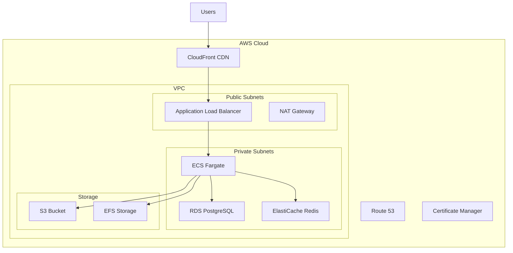

# Cloud Deployment Guide

## Overview

This guide covers deploying the BIM Wall System on major cloud platforms (AWS, Azure, GCP) using cloud-native services, infrastructure as code, and best practices for scalability, security, and cost optimization.

## AWS Deployment

### AWS Architecture Overview



### Terraform Infrastructure

```hcl
# terraform/aws/main.tf
terraform {
  required_version = ">= 1.0"
  required_providers {
    aws = {
      source  = "hashicorp/aws"
      version = "~> 5.0"
    }
  }
  
  backend "s3" {
    bucket = "your-terraform-state-bucket"
    key    = "bim-wall-system/terraform.tfstate"
    region = "us-west-2"
  }
}

provider "aws" {
  region = var.aws_region
  
  default_tags {
    tags = {
      Project     = "BIM Wall System"
      Environment = var.environment
      ManagedBy   = "Terraform"
    }
  }
}

# VPC Configuration
module "vpc" {
  source = "terraform-aws-modules/vpc/aws"
  
  name = "${var.project_name}-vpc"
  cidr = var.vpc_cidr
  
  azs             = var.availability_zones
  private_subnets = var.private_subnet_cidrs
  public_subnets  = var.public_subnet_cidrs
  
  enable_nat_gateway = true
  enable_vpn_gateway = false
  enable_dns_hostnames = true
  enable_dns_support = true
  
  tags = {
    Name = "${var.project_name}-vpc"
  }
}

# Security Groups
resource "aws_security_group" "alb" {
  name_prefix = "${var.project_name}-alb-"
  vpc_id      = module.vpc.vpc_id
  
  ingress {
    from_port   = 80
    to_port     = 80
    protocol    = "tcp"
    cidr_blocks = ["0.0.0.0/0"]
  }
  
  ingress {
    from_port   = 443
    to_port     = 443
    protocol    = "tcp"
    cidr_blocks = ["0.0.0.0/0"]
  }
  
  egress {
    from_port   = 0
    to_port     = 0
    protocol    = "-1"
    cidr_blocks = ["0.0.0.0/0"]
  }
}

resource "aws_security_group" "ecs" {
  name_prefix = "${var.project_name}-ecs-"
  vpc_id      = module.vpc.vpc_id
  
  ingress {
    from_port       = 3000
    to_port         = 3000
    protocol        = "tcp"
    security_groups = [aws_security_group.alb.id]
  }
  
  egress {
    from_port   = 0
    to_port     = 0
    protocol    = "-1"
    cidr_blocks = ["0.0.0.0/0"]
  }
}

resource "aws_security_group" "rds" {
  name_prefix = "${var.project_name}-rds-"
  vpc_id      = module.vpc.vpc_id
  
  ingress {
    from_port       = 5432
    to_port         = 5432
    protocol        = "tcp"
    security_groups = [aws_security_group.ecs.id]
  }
}

# RDS PostgreSQL
resource "aws_db_subnet_group" "main" {
  name       = "${var.project_name}-db-subnet-group"
  subnet_ids = module.vpc.private_subnets
}

resource "aws_db_instance" "postgres" {
  identifier = "${var.project_name}-postgres"
  
  engine         = "postgres"
  engine_version = "14.9"
  instance_class = var.rds_instance_class
  
  allocated_storage     = var.rds_allocated_storage
  max_allocated_storage = var.rds_max_allocated_storage
  storage_type          = "gp3"
  storage_encrypted     = true
  
  db_name  = var.database_name
  username = var.database_username
  password = var.database_password
  
  vpc_security_group_ids = [aws_security_group.rds.id]
  db_subnet_group_name   = aws_db_subnet_group.main.name
  
  backup_retention_period = 7
  backup_window          = "03:00-04:00"
  maintenance_window     = "sun:04:00-sun:05:00"
  
  skip_final_snapshot = var.environment == "development"
  deletion_protection = var.environment == "production"
  
  performance_insights_enabled = true
  monitoring_interval         = 60
  monitoring_role_arn        = aws_iam_role.rds_monitoring.arn
}

# ElastiCache Redis
resource "aws_elasticache_subnet_group" "main" {
  name       = "${var.project_name}-cache-subnet"
  subnet_ids = module.vpc.private_subnets
}

resource "aws_elasticache_replication_group" "redis" {
  replication_group_id       = "${var.project_name}-redis"
  description                = "Redis cluster for BIM Wall System"
  
  node_type                  = var.redis_node_type
  port                       = 6379
  parameter_group_name       = "default.redis7"
  
  num_cache_clusters         = var.redis_num_cache_nodes
  automatic_failover_enabled = var.redis_num_cache_nodes > 1
  multi_az_enabled          = var.redis_num_cache_nodes > 1
  
  subnet_group_name = aws_elasticache_subnet_group.main.name
  security_group_ids = [aws_security_group.redis.id]
  
  at_rest_encryption_enabled = true
  transit_encryption_enabled = true
  auth_token                = var.redis_auth_token
  
  snapshot_retention_limit = 5
  snapshot_window         = "03:00-05:00"
}

# ECS Cluster
resource "aws_ecs_cluster" "main" {
  name = "${var.project_name}-cluster"
  
  configuration {
    execute_command_configuration {
      logging = "OVERRIDE"
      
      log_configuration {
        cloud_watch_encryption_enabled = true
        cloud_watch_log_group_name     = aws_cloudwatch_log_group.ecs.name
      }
    }
  }
  
  setting {
    name  = "containerInsights"
    value = "enabled"
  }
}

# ECS Task Definition
resource "aws_ecs_task_definition" "app" {
  family                   = "${var.project_name}-app"
  network_mode             = "awsvpc"
  requires_compatibilities = ["FARGATE"]
  cpu                      = var.ecs_cpu
  memory                   = var.ecs_memory
  execution_role_arn       = aws_iam_role.ecs_execution.arn
  task_role_arn           = aws_iam_role.ecs_task.arn
  
  container_definitions = jsonencode([
    {
      name  = "bim-app"
      image = "${var.ecr_repository_url}:${var.app_version}"
      
      portMappings = [
        {
          containerPort = 3000
          protocol      = "tcp"
        }
      ]
      
      environment = [
        {
          name  = "NODE_ENV"
          value = var.environment
        },
        {
          name  = "DB_TYPE"
          value = "postgres"
        },
        {
          name  = "DB_HOST"
          value = aws_db_instance.postgres.endpoint
        },
        {
          name  = "DB_PORT"
          value = "5432"
        },
        {
          name  = "DB_NAME"
          value = var.database_name
        },
        {
          name  = "REDIS_HOST"
          value = aws_elasticache_replication_group.redis.primary_endpoint_address
        }
      ]
      
      secrets = [
        {
          name      = "DB_PASSWORD"
          valueFrom = aws_ssm_parameter.db_password.arn
        },
        {
          name      = "JWT_SECRET"
          valueFrom = aws_ssm_parameter.jwt_secret.arn
        },
        {
          name      = "REDIS_PASSWORD"
          valueFrom = aws_ssm_parameter.redis_password.arn
        }
      ]
      
      logConfiguration = {
        logDriver = "awslogs"
        options = {
          awslogs-group         = aws_cloudwatch_log_group.ecs.name
          awslogs-region        = var.aws_region
          awslogs-stream-prefix = "ecs"
        }
      }
      
      healthCheck = {
        command     = ["CMD-SHELL", "curl -f http://localhost:3000/health || exit 1"]
        interval    = 30
        timeout     = 5
        retries     = 3
        startPeriod = 60
      }
    }
  ])
}

# ECS Service
resource "aws_ecs_service" "app" {
  name            = "${var.project_name}-service"
  cluster         = aws_ecs_cluster.main.id
  task_definition = aws_ecs_task_definition.app.arn
  desired_count   = var.ecs_desired_count
  launch_type     = "FARGATE"
  
  network_configuration {
    subnets          = module.vpc.private_subnets
    security_groups  = [aws_security_group.ecs.id]
    assign_public_ip = false
  }
  
  load_balancer {
    target_group_arn = aws_lb_target_group.app.arn
    container_name   = "bim-app"
    container_port   = 3000
  }
  
  depends_on = [aws_lb_listener.app]
  
  deployment_configuration {
    maximum_percent         = 200
    minimum_healthy_percent = 100
  }
  
  enable_execute_command = true
}

# Application Load Balancer
resource "aws_lb" "main" {
  name               = "${var.project_name}-alb"
  internal           = false
  load_balancer_type = "application"
  security_groups    = [aws_security_group.alb.id]
  subnets           = module.vpc.public_subnets
  
  enable_deletion_protection = var.environment == "production"
}

resource "aws_lb_target_group" "app" {
  name        = "${var.project_name}-tg"
  port        = 3000
  protocol    = "HTTP"
  vpc_id      = module.vpc.vpc_id
  target_type = "ip"
  
  health_check {
    enabled             = true
    healthy_threshold   = 2
    interval            = 30
    matcher             = "200"
    path                = "/health"
    port                = "traffic-port"
    protocol            = "HTTP"
    timeout             = 5
    unhealthy_threshold = 2
  }
}

resource "aws_lb_listener" "app" {
  load_balancer_arn = aws_lb.main.arn
  port              = "443"
  protocol          = "HTTPS"
  ssl_policy        = "ELBSecurityPolicy-TLS-1-2-2017-01"
  certificate_arn   = aws_acm_certificate.main.arn
  
  default_action {
    type             = "forward"
    target_group_arn = aws_lb_target_group.app.arn
  }
}

# Auto Scaling
resource "aws_appautoscaling_target" "ecs" {
  max_capacity       = var.ecs_max_capacity
  min_capacity       = var.ecs_min_capacity
  resource_id        = "service/${aws_ecs_cluster.main.name}/${aws_ecs_service.app.name}"
  scalable_dimension = "ecs:service:DesiredCount"
  service_namespace  = "ecs"
}

resource "aws_appautoscaling_policy" "ecs_cpu" {
  name               = "${var.project_name}-cpu-scaling"
  policy_type        = "TargetTrackingScaling"
  resource_id        = aws_appautoscaling_target.ecs.resource_id
  scalable_dimension = aws_appautoscaling_target.ecs.scalable_dimension
  service_namespace  = aws_appautoscaling_target.ecs.service_namespace
  
  target_tracking_scaling_policy_configuration {
    predefined_metric_specification {
      predefined_metric_type = "ECSServiceAverageCPUUtilization"
    }
    target_value = 70.0
  }
}

# S3 Bucket for file storage
resource "aws_s3_bucket" "storage" {
  bucket = "${var.project_name}-storage-${random_id.bucket_suffix.hex}"
}

resource "aws_s3_bucket_versioning" "storage" {
  bucket = aws_s3_bucket.storage.id
  versioning_configuration {
    status = "Enabled"
  }
}

resource "aws_s3_bucket_encryption" "storage" {
  bucket = aws_s3_bucket.storage.id
  
  server_side_encryption_configuration {
    rule {
      apply_server_side_encryption_by_default {
        sse_algorithm = "AES256"
      }
    }
  }
}

# CloudFront Distribution
resource "aws_cloudfront_distribution" "main" {
  origin {
    domain_name = aws_lb.main.dns_name
    origin_id   = "ALB-${var.project_name}"
    
    custom_origin_config {
      http_port              = 80
      https_port             = 443
      origin_protocol_policy = "https-only"
      origin_ssl_protocols   = ["TLSv1.2"]
    }
  }
  
  enabled = true
  
  default_cache_behavior {
    allowed_methods        = ["DELETE", "GET", "HEAD", "OPTIONS", "PATCH", "POST", "PUT"]
    cached_methods         = ["GET", "HEAD"]
    target_origin_id       = "ALB-${var.project_name}"
    compress               = true
    viewer_protocol_policy = "redirect-to-https"
    
    forwarded_values {
      query_string = true
      headers      = ["Host", "Authorization"]
      
      cookies {
        forward = "all"
      }
    }
  }
  
  restrictions {
    geo_restriction {
      restriction_type = "none"
    }
  }
  
  viewer_certificate {
    acm_certificate_arn = aws_acm_certificate.main.arn
    ssl_support_method  = "sni-only"
  }
  
  aliases = [var.domain_name]
}
```

### AWS Variables

```hcl
# terraform/aws/variables.tf
variable "aws_region" {
  description = "AWS region"
  type        = string
  default     = "us-west-2"
}

variable "environment" {
  description = "Environment name"
  type        = string
  default     = "production"
}

variable "project_name" {
  description = "Project name"
  type        = string
  default     = "bim-wall-system"
}

variable "domain_name" {
  description = "Domain name for the application"
  type        = string
}

variable "vpc_cidr" {
  description = "CIDR block for VPC"
  type        = string
  default     = "10.0.0.0/16"
}

variable "availability_zones" {
  description = "Availability zones"
  type        = list(string)
  default     = ["us-west-2a", "us-west-2b", "us-west-2c"]
}

variable "private_subnet_cidrs" {
  description = "CIDR blocks for private subnets"
  type        = list(string)
  default     = ["10.0.1.0/24", "10.0.2.0/24", "10.0.3.0/24"]
}

variable "public_subnet_cidrs" {
  description = "CIDR blocks for public subnets"
  type        = list(string)
  default     = ["10.0.101.0/24", "10.0.102.0/24", "10.0.103.0/24"]
}

variable "rds_instance_class" {
  description = "RDS instance class"
  type        = string
  default     = "db.t3.medium"
}

variable "rds_allocated_storage" {
  description = "RDS allocated storage in GB"
  type        = number
  default     = 100
}

variable "rds_max_allocated_storage" {
  description = "RDS max allocated storage in GB"
  type        = number
  default     = 1000
}

variable "redis_node_type" {
  description = "ElastiCache Redis node type"
  type        = string
  default     = "cache.t3.micro"
}

variable "redis_num_cache_nodes" {
  description = "Number of cache nodes"
  type        = number
  default     = 2
}

variable "ecs_cpu" {
  description = "ECS task CPU"
  type        = number
  default     = 512
}

variable "ecs_memory" {
  description = "ECS task memory"
  type        = number
  default     = 1024
}

variable "ecs_desired_count" {
  description = "ECS service desired count"
  type        = number
  default     = 2
}

variable "ecs_min_capacity" {
  description = "ECS service minimum capacity"
  type        = number
  default     = 2
}

variable "ecs_max_capacity" {
  description = "ECS service maximum capacity"
  type        = number
  default     = 10
}
```

## Azure Deployment

### Azure Resource Manager Template

```json
{
  "$schema": "https://schema.management.azure.com/schemas/2019-04-01/deploymentTemplate.json#",
  "contentVersion": "1.0.0.0",
  "parameters": {
    "projectName": {
      "type": "string",
      "defaultValue": "bim-wall-system",
      "metadata": {
        "description": "Name of the project"
      }
    },
    "environment": {
      "type": "string",
      "defaultValue": "production",
      "allowedValues": ["development", "staging", "production"]
    },
    "location": {
      "type": "string",
      "defaultValue": "[resourceGroup().location]"
    },
    "containerImageTag": {
      "type": "string",
      "defaultValue": "latest"
    }
  },
  "variables": {
    "resourcePrefix": "[concat(parameters('projectName'), '-', parameters('environment'))]",
    "vnetName": "[concat(variables('resourcePrefix'), '-vnet')]",
    "subnetName": "[concat(variables('resourcePrefix'), '-subnet')]",
    "acrName": "[concat(replace(variables('resourcePrefix'), '-', ''), 'acr')]",
    "appServicePlanName": "[concat(variables('resourcePrefix'), '-asp')]",
    "webAppName": "[concat(variables('resourcePrefix'), '-webapp')]",
    "postgresServerName": "[concat(variables('resourcePrefix'), '-postgres')]",
    "redisName": "[concat(variables('resourcePrefix'), '-redis')]",
    "storageAccountName": "[concat(replace(variables('resourcePrefix'), '-', ''), 'storage')]",
    "keyVaultName": "[concat(variables('resourcePrefix'), '-kv')]",
    "appInsightsName": "[concat(variables('resourcePrefix'), '-ai')]"
  },
  "resources": [
    {
      "type": "Microsoft.Network/virtualNetworks",
      "apiVersion": "2021-02-01",
      "name": "[variables('vnetName')]",
      "location": "[parameters('location')]",
      "properties": {
        "addressSpace": {
          "addressPrefixes": ["10.0.0.0/16"]
        },
        "subnets": [
          {
            "name": "[variables('subnetName')]",
            "properties": {
              "addressPrefix": "10.0.1.0/24",
              "delegations": [
                {
                  "name": "webapp-delegation",
                  "properties": {
                    "serviceName": "Microsoft.Web/serverFarms"
                  }
                }
              ]
            }
          }
        ]
      }
    },
    {
      "type": "Microsoft.ContainerRegistry/registries",
      "apiVersion": "2021-06-01-preview",
      "name": "[variables('acrName')]",
      "location": "[parameters('location')]",
      "sku": {
        "name": "Standard"
      },
      "properties": {
        "adminUserEnabled": true
      }
    },
    {
      "type": "Microsoft.DBforPostgreSQL/flexibleServers",
      "apiVersion": "2021-06-01",
      "name": "[variables('postgresServerName')]",
      "location": "[parameters('location')]",
      "sku": {
        "name": "Standard_B2s",
        "tier": "Burstable"
      },
      "properties": {
        "administratorLogin": "bimadmin",
        "administratorLoginPassword": "[concat('P@ssw0rd', uniqueString(resourceGroup().id))]",
        "version": "14",
        "storage": {
          "storageSizeGB": 128
        },
        "backup": {
          "backupRetentionDays": 7,
          "geoRedundantBackup": "Disabled"
        },
        "highAvailability": {
          "mode": "Disabled"
        }
      }
    },
    {
      "type": "Microsoft.DBforPostgreSQL/flexibleServers/databases",
      "apiVersion": "2021-06-01",
      "name": "[concat(variables('postgresServerName'), '/bim_walls')]",
      "dependsOn": [
        "[resourceId('Microsoft.DBforPostgreSQL/flexibleServers', variables('postgresServerName'))]"
      ],
      "properties": {
        "charset": "UTF8",
        "collation": "en_US.UTF8"
      }
    },
    {
      "type": "Microsoft.Cache/Redis",
      "apiVersion": "2021-06-01",
      "name": "[variables('redisName')]",
      "location": "[parameters('location')]",
      "properties": {
        "sku": {
          "name": "Standard",
          "family": "C",
          "capacity": 1
        },
        "enableNonSslPort": false,
        "minimumTlsVersion": "1.2",
        "redisConfiguration": {
          "maxmemory-policy": "allkeys-lru"
        }
      }
    },
    {
      "type": "Microsoft.Storage/storageAccounts",
      "apiVersion": "2021-04-01",
      "name": "[variables('storageAccountName')]",
      "location": "[parameters('location')]",
      "sku": {
        "name": "Standard_LRS"
      },
      "kind": "StorageV2",
      "properties": {
        "supportsHttpsTrafficOnly": true,
        "minimumTlsVersion": "TLS1_2"
      }
    },
    {
      "type": "Microsoft.KeyVault/vaults",
      "apiVersion": "2021-06-01-preview",
      "name": "[variables('keyVaultName')]",
      "location": "[parameters('location')]",
      "properties": {
        "sku": {
          "family": "A",
          "name": "standard"
        },
        "tenantId": "[subscription().tenantId]",
        "accessPolicies": [],
        "enabledForDeployment": false,
        "enabledForDiskEncryption": false,
        "enabledForTemplateDeployment": true,
        "enableSoftDelete": true,
        "softDeleteRetentionInDays": 90
      }
    },
    {
      "type": "Microsoft.Insights/components",
      "apiVersion": "2020-02-02",
      "name": "[variables('appInsightsName')]",
      "location": "[parameters('location')]",
      "kind": "web",
      "properties": {
        "Application_Type": "web",
        "RetentionInDays": 90
      }
    },
    {
      "type": "Microsoft.Web/serverfarms",
      "apiVersion": "2021-02-01",
      "name": "[variables('appServicePlanName')]",
      "location": "[parameters('location')]",
      "sku": {
        "name": "P1v3",
        "tier": "PremiumV3",
        "size": "P1v3",
        "family": "Pv3",
        "capacity": 2
      },
      "kind": "linux",
      "properties": {
        "reserved": true
      }
    },
    {
      "type": "Microsoft.Web/sites",
      "apiVersion": "2021-02-01",
      "name": "[variables('webAppName')]",
      "location": "[parameters('location')]",
      "dependsOn": [
        "[resourceId('Microsoft.Web/serverfarms', variables('appServicePlanName'))]",
        "[resourceId('Microsoft.ContainerRegistry/registries', variables('acrName'))]",
        "[resourceId('Microsoft.DBforPostgreSQL/flexibleServers', variables('postgresServerName'))]",
        "[resourceId('Microsoft.Cache/Redis', variables('redisName'))]",
        "[resourceId('Microsoft.Insights/components', variables('appInsightsName'))]"
      ],
      "kind": "app,linux,container",
      "properties": {
        "serverFarmId": "[resourceId('Microsoft.Web/serverfarms', variables('appServicePlanName'))]",
        "siteConfig": {
          "linuxFxVersion": "[concat('DOCKER|', variables('acrName'), '.azurecr.io/bim-wall-system:', parameters('containerImageTag'))]",
          "appSettings": [
            {
              "name": "NODE_ENV",
              "value": "[parameters('environment')]"
            },
            {
              "name": "DB_TYPE",
              "value": "postgres"
            },
            {
              "name": "DB_HOST",
              "value": "[concat(variables('postgresServerName'), '.postgres.database.azure.com')]"
            },
            {
              "name": "DB_PORT",
              "value": "5432"
            },
            {
              "name": "DB_NAME",
              "value": "bim_walls"
            },
            {
              "name": "DB_USERNAME",
              "value": "bimadmin"
            },
            {
              "name": "REDIS_HOST",
              "value": "[concat(variables('redisName'), '.redis.cache.windows.net')]"
            },
            {
              "name": "REDIS_PORT",
              "value": "6380"
            },
            {
              "name": "APPINSIGHTS_INSTRUMENTATIONKEY",
              "value": "[reference(resourceId('Microsoft.Insights/components', variables('appInsightsName'))).InstrumentationKey]"
            },
            {
              "name": "DOCKER_REGISTRY_SERVER_URL",
              "value": "[concat('https://', variables('acrName'), '.azurecr.io')]"
            },
            {
              "name": "DOCKER_REGISTRY_SERVER_USERNAME",
              "value": "[variables('acrName')]"
            },
            {
              "name": "DOCKER_REGISTRY_SERVER_PASSWORD",
              "value": "[listCredentials(resourceId('Microsoft.ContainerRegistry/registries', variables('acrName')), '2021-06-01-preview').passwords[0].value]"
            }
          ]
        },
        "httpsOnly": true
      }
    }
  ],
  "outputs": {
    "webAppUrl": {
      "type": "string",
      "value": "[concat('https://', variables('webAppName'), '.azurewebsites.net')]"
    },
    "postgresServerName": {
      "type": "string",
      "value": "[variables('postgresServerName')]"
    },
    "redisName": {
      "type": "string",
      "value": "[variables('redisName')]"
    }
  }
}
```

### Azure Bicep Template

```bicep
// main.bicep
@description('Name of the project')
param projectName string = 'bim-wall-system'

@description('Environment name')
@allowed(['development', 'staging', 'production'])
param environment string = 'production'

@description('Location for all resources')
param location string = resourceGroup().location

@description('Container image tag')
param containerImageTag string = 'latest'

var resourcePrefix = '${projectName}-${environment}'

// Virtual Network
resource vnet 'Microsoft.Network/virtualNetworks@2021-02-01' = {
  name: '${resourcePrefix}-vnet'
  location: location
  properties: {
    addressSpace: {
      addressPrefixes: ['10.0.0.0/16']
    }
    subnets: [
      {
        name: '${resourcePrefix}-subnet'
        properties: {
          addressPrefix: '10.0.1.0/24'
          delegations: [
            {
              name: 'webapp-delegation'
              properties: {
                serviceName: 'Microsoft.Web/serverFarms'
              }
            }
          ]
        }
      }
    ]
  }
}

// Container Registry
resource acr 'Microsoft.ContainerRegistry/registries@2021-06-01-preview' = {
  name: '${replace(resourcePrefix, '-', '')}acr'
  location: location
  sku: {
    name: 'Standard'
  }
  properties: {
    adminUserEnabled: true
  }
}

// PostgreSQL Database
resource postgres 'Microsoft.DBforPostgreSQL/flexibleServers@2021-06-01' = {
  name: '${resourcePrefix}-postgres'
  location: location
  sku: {
    name: 'Standard_B2s'
    tier: 'Burstable'
  }
  properties: {
    administratorLogin: 'bimadmin'
    administratorLoginPassword: 'P@ssw0rd${uniqueString(resourceGroup().id)}'
    version: '14'
    storage: {
      storageSizeGB: 128
    }
    backup: {
      backupRetentionDays: 7
      geoRedundantBackup: 'Disabled'
    }
    highAvailability: {
      mode: 'Disabled'
    }
  }
}

resource postgresDb 'Microsoft.DBforPostgreSQL/flexibleServers/databases@2021-06-01' = {
  parent: postgres
  name: 'bim_walls'
  properties: {
    charset: 'UTF8'
    collation: 'en_US.UTF8'
  }
}

// Redis Cache
resource redis 'Microsoft.Cache/Redis@2021-06-01' = {
  name: '${resourcePrefix}-redis'
  location: location
  properties: {
    sku: {
      name: 'Standard'
      family: 'C'
      capacity: 1
    }
    enableNonSslPort: false
    minimumTlsVersion: '1.2'
    redisConfiguration: {
      'maxmemory-policy': 'allkeys-lru'
    }
  }
}

// App Service Plan
resource appServicePlan 'Microsoft.Web/serverfarms@2021-02-01' = {
  name: '${resourcePrefix}-asp'
  location: location
  sku: {
    name: 'P1v3'
    tier: 'PremiumV3'
    size: 'P1v3'
    family: 'Pv3'
    capacity: 2
  }
  kind: 'linux'
  properties: {
    reserved: true
  }
}

// Web App
resource webApp 'Microsoft.Web/sites@2021-02-01' = {
  name: '${resourcePrefix}-webapp'
  location: location
  kind: 'app,linux,container'
  properties: {
    serverFarmId: appServicePlan.id
    siteConfig: {
      linuxFxVersion: 'DOCKER|${acr.name}.azurecr.io/bim-wall-system:${containerImageTag}'
      appSettings: [
        {
          name: 'NODE_ENV'
          value: environment
        }
        {
          name: 'DB_TYPE'
          value: 'postgres'
        }
        {
          name: 'DB_HOST'
          value: '${postgres.name}.postgres.database.azure.com'
        }
        {
          name: 'DB_PORT'
          value: '5432'
        }
        {
          name: 'DB_NAME'
          value: 'bim_walls'
        }
        {
          name: 'DB_USERNAME'
          value: 'bimadmin'
        }
        {
          name: 'REDIS_HOST'
          value: '${redis.name}.redis.cache.windows.net'
        }
        {
          name: 'REDIS_PORT'
          value: '6380'
        }
        {
          name: 'DOCKER_REGISTRY_SERVER_URL'
          value: 'https://${acr.name}.azurecr.io'
        }
        {
          name: 'DOCKER_REGISTRY_SERVER_USERNAME'
          value: acr.name
        }
        {
          name: 'DOCKER_REGISTRY_SERVER_PASSWORD'
          value: acr.listCredentials().passwords[0].value
        }
      ]
    }
    httpsOnly: true
  }
}

output webAppUrl string = 'https://${webApp.name}.azurewebsites.net'
output postgresServerName string = postgres.name
output redisName string = redis.name
```

## Google Cloud Platform (GCP) Deployment

### GCP Terraform Configuration

```hcl
# terraform/gcp/main.tf
terraform {
  required_version = ">= 1.0"
  required_providers {
    google = {
      source  = "hashicorp/google"
      version = "~> 4.0"
    }
  }
  
  backend "gcs" {
    bucket = "your-terraform-state-bucket"
    prefix = "bim-wall-system/terraform.tfstate"
  }
}

provider "google" {
  project = var.project_id
  region  = var.region
  zone    = var.zone
}

# Enable required APIs
resource "google_project_service" "apis" {
  for_each = toset([
    "compute.googleapis.com",
    "container.googleapis.com",
    "sqladmin.googleapis.com",
    "redis.googleapis.com",
    "storage.googleapis.com",
    "cloudresourcemanager.googleapis.com",
    "iam.googleapis.com"
  ])
  
  project = var.project_id
  service = each.value
  
  disable_dependent_services = true
}

# VPC Network
resource "google_compute_network" "vpc" {
  name                    = "${var.project_name}-vpc"
  auto_create_subnetworks = false
  
  depends_on = [google_project_service.apis]
}

resource "google_compute_subnetwork" "subnet" {
  name          = "${var.project_name}-subnet"
  ip_cidr_range = "10.0.0.0/24"
  region        = var.region
  network       = google_compute_network.vpc.id
  
  secondary_ip_range {
    range_name    = "pods"
    ip_cidr_range = "10.1.0.0/16"
  }
  
  secondary_ip_range {
    range_name    = "services"
    ip_cidr_range = "10.2.0.0/16"
  }
}

# GKE Cluster
resource "google_container_cluster" "primary" {
  name     = "${var.project_name}-gke"
  location = var.region
  
  remove_default_node_pool = true
  initial_node_count       = 1
  
  network    = google_compute_network.vpc.name
  subnetwork = google_compute_subnetwork.subnet.name
  
  ip_allocation_policy {
    cluster_secondary_range_name  = "pods"
    services_secondary_range_name = "services"
  }
  
  workload_identity_config {
    workload_pool = "${var.project_id}.svc.id.goog"
  }
  
  addons_config {
    http_load_balancing {
      disabled = false
    }
    
    horizontal_pod_autoscaling {
      disabled = false
    }
    
    network_policy_config {
      disabled = false
    }
  }
  
  network_policy {
    enabled = true
  }
  
  depends_on = [google_project_service.apis]
}

resource "google_container_node_pool" "primary_nodes" {
  name       = "${var.project_name}-node-pool"
  location   = var.region
  cluster    = google_container_cluster.primary.name
  node_count = var.gke_num_nodes
  
  node_config {
    preemptible  = var.gke_preemptible
    machine_type = var.gke_machine_type
    
    service_account = google_service_account.gke.email
    oauth_scopes = [
      "https://www.googleapis.com/auth/logging.write",
      "https://www.googleapis.com/auth/monitoring",
      "https://www.googleapis.com/auth/devstorage.read_only"
    ]
    
    workload_metadata_config {
      mode = "GKE_METADATA"
    }
  }
  
  autoscaling {
    min_node_count = var.gke_min_nodes
    max_node_count = var.gke_max_nodes
  }
  
  management {
    auto_repair  = true
    auto_upgrade = true
  }
}

# Service Account for GKE
resource "google_service_account" "gke" {
  account_id   = "${var.project_name}-gke-sa"
  display_name = "GKE Service Account"
}

# Cloud SQL PostgreSQL
resource "google_sql_database_instance" "postgres" {
  name             = "${var.project_name}-postgres"
  database_version = "POSTGRES_14"
  region           = var.region
  
  settings {
    tier = var.cloudsql_tier
    
    disk_type    = "PD_SSD"
    disk_size    = var.cloudsql_disk_size
    disk_autoresize = true
    
    backup_configuration {
      enabled                        = true
      start_time                     = "03:00"
      point_in_time_recovery_enabled = true
      backup_retention_settings {
        retained_backups = 7
      }
    }
    
    ip_configuration {
      ipv4_enabled    = false
      private_network = google_compute_network.vpc.id
      require_ssl     = true
    }
    
    database_flags {
      name  = "shared_preload_libraries"
      value = "postgis"
    }
  }
  
  depends_on = [google_service_networking_connection.private_vpc_connection]
}

resource "google_sql_database" "database" {
  name     = "bim_walls"
  instance = google_sql_database_instance.postgres.name
}

resource "google_sql_user" "user" {
  name     = "bim_user"
  instance = google_sql_database_instance.postgres.name
  password = var.database_password
}

# Private Service Connection for Cloud SQL
resource "google_compute_global_address" "private_ip_address" {
  name          = "${var.project_name}-private-ip"
  purpose       = "VPC_PEERING"
  address_type  = "INTERNAL"
  prefix_length = 16
  network       = google_compute_network.vpc.id
}

resource "google_service_networking_connection" "private_vpc_connection" {
  network                 = google_compute_network.vpc.id
  service                 = "servicenetworking.googleapis.com"
  reserved_peering_ranges = [google_compute_global_address.private_ip_address.name]
}

# Memorystore Redis
resource "google_redis_instance" "cache" {
  name           = "${var.project_name}-redis"
  tier           = "STANDARD_HA"
  memory_size_gb = var.redis_memory_size
  
  location_id             = var.zone
  alternative_location_id = var.alternative_zone
  
  authorized_network = google_compute_network.vpc.id
  
  redis_version     = "REDIS_6_X"
  display_name      = "BIM Wall System Redis"
  
  auth_enabled = true
}

# Cloud Storage Bucket
resource "google_storage_bucket" "storage" {
  name     = "${var.project_name}-storage-${random_id.bucket_suffix.hex}"
  location = var.region
  
  uniform_bucket_level_access = true
  
  versioning {
    enabled = true
  }
  
  encryption {
    default_kms_key_name = google_kms_crypto_key.storage_key.id
  }
}

# KMS for encryption
resource "google_kms_key_ring" "keyring" {
  name     = "${var.project_name}-keyring"
  location = var.region
}

resource "google_kms_crypto_key" "storage_key" {
  name     = "storage-key"
  key_ring = google_kms_key_ring.keyring.id
  
  lifecycle {
    prevent_destroy = true
  }
}

# Container Registry
resource "google_container_registry" "registry" {
  project  = var.project_id
  location = "US"
}

# Load Balancer
resource "google_compute_global_address" "default" {
  name = "${var.project_name}-address"
}

# Random ID for unique naming
resource "random_id" "bucket_suffix" {
  byte_length = 8
}
```

## Multi-Cloud Deployment Scripts

### Universal Deployment Script

```bash
#!/bin/bash
# deploy-cloud.sh - Universal cloud deployment script

set -e

CLOUD_PROVIDER=${1:-aws}
ENVIRONMENT=${2:-production}
PROJECT_NAME=${3:-bim-wall-system}

echo "Deploying BIM Wall System to $CLOUD_PROVIDER ($ENVIRONMENT environment)..."

case $CLOUD_PROVIDER in
    "aws")
        deploy_aws
        ;;
    "azure")
        deploy_azure
        ;;
    "gcp")
        deploy_gcp
        ;;
    *)
        echo "Unsupported cloud provider: $CLOUD_PROVIDER"
        echo "Supported providers: aws, azure, gcp"
        exit 1
        ;;
esac

deploy_aws() {
    echo "Deploying to AWS..."
    
    # Check AWS CLI
    if ! command -v aws &> /dev/null; then
        echo "AWS CLI not found. Please install it first."
        exit 1
    fi
    
    # Check Terraform
    if ! command -v terraform &> /dev/null; then
        echo "Terraform not found. Please install it first."
        exit 1
    fi
    
    cd terraform/aws
    
    # Initialize Terraform
    terraform init
    
    # Plan deployment
    terraform plan -var="environment=$ENVIRONMENT" -var="project_name=$PROJECT_NAME"
    
    # Apply deployment
    terraform apply -var="environment=$ENVIRONMENT" -var="project_name=$PROJECT_NAME" -auto-approve
    
    echo "AWS deployment completed!"
}

deploy_azure() {
    echo "Deploying to Azure..."
    
    # Check Azure CLI
    if ! command -v az &> /dev/null; then
        echo "Azure CLI not found. Please install it first."
        exit 1
    fi
    
    # Login check
    if ! az account show &> /dev/null; then
        echo "Please login to Azure: az login"
        exit 1
    fi
    
    # Create resource group
    RESOURCE_GROUP="${PROJECT_NAME}-${ENVIRONMENT}-rg"
    LOCATION="East US"
    
    az group create --name "$RESOURCE_GROUP" --location "$LOCATION"
    
    # Deploy ARM template
    az deployment group create \
        --resource-group "$RESOURCE_GROUP" \
        --template-file azure/azuredeploy.json \
        --parameters projectName="$PROJECT_NAME" environment="$ENVIRONMENT"
    
    echo "Azure deployment completed!"
}

deploy_gcp() {
    echo "Deploying to GCP..."
    
    # Check gcloud CLI
    if ! command -v gcloud &> /dev/null; then
        echo "gcloud CLI not found. Please install it first."
        exit 1
    fi
    
    # Check authentication
    if ! gcloud auth list --filter=status:ACTIVE --format="value(account)" | head -n1 &> /dev/null; then
        echo "Please authenticate with GCP: gcloud auth login"
        exit 1
    fi
    
    cd terraform/gcp
    
    # Initialize Terraform
    terraform init
    
    # Plan deployment
    terraform plan -var="environment=$ENVIRONMENT" -var="project_name=$PROJECT_NAME"
    
    # Apply deployment
    terraform apply -var="environment=$ENVIRONMENT" -var="project_name=$PROJECT_NAME" -auto-approve
    
    echo "GCP deployment completed!"
}

echo "Cloud deployment script completed!"
```

### Cost Optimization Script

```bash
#!/bin/bash
# optimize-costs.sh - Cloud cost optimization script

set -e

CLOUD_PROVIDER=${1:-aws}
ENVIRONMENT=${2:-production}

echo "Optimizing costs for $CLOUD_PROVIDER ($ENVIRONMENT environment)..."

case $CLOUD_PROVIDER in
    "aws")
        optimize_aws_costs
        ;;
    "azure")
        optimize_azure_costs
        ;;
    "gcp")
        optimize_gcp_costs
        ;;
    *)
        echo "Unsupported cloud provider: $CLOUD_PROVIDER"
        exit 1
        ;;
esac

optimize_aws_costs() {
    echo "Optimizing AWS costs..."
    
    # Stop non-production resources during off-hours
    if [ "$ENVIRONMENT" != "production" ]; then
        # Stop ECS services
        aws ecs update-service --cluster bim-wall-system-cluster --service bim-wall-system-service --desired-count 0
        
        # Stop RDS instances
        aws rds stop-db-instance --db-instance-identifier bim-wall-system-postgres
    fi
    
    # Enable S3 lifecycle policies
    aws s3api put-bucket-lifecycle-configuration \
        --bucket bim-wall-system-storage \
        --lifecycle-configuration file://aws/s3-lifecycle.json
    
    # Set up CloudWatch alarms for cost monitoring
    aws cloudwatch put-metric-alarm \
        --alarm-name "BIM-High-Cost-Alert" \
        --alarm-description "Alert when costs exceed threshold" \
        --metric-name EstimatedCharges \
        --namespace AWS/Billing \
        --statistic Maximum \
        --period 86400 \
        --threshold 100 \
        --comparison-operator GreaterThanThreshold
    
    echo "AWS cost optimization completed!"
}

optimize_azure_costs() {
    echo "Optimizing Azure costs..."
    
    # Scale down non-production resources
    if [ "$ENVIRONMENT" != "production" ]; then
        az webapp stop --name bim-wall-system-webapp --resource-group bim-wall-system-rg
    fi
    
    # Enable auto-shutdown for VMs
    az vm auto-shutdown -g bim-wall-system-rg -n bim-wall-system-vm --time 1900
    
    echo "Azure cost optimization completed!"
}

optimize_gcp_costs() {
    echo "Optimizing GCP costs..."
    
    # Scale down GKE cluster during off-hours
    if [ "$ENVIRONMENT" != "production" ]; then
        gcloud container clusters resize bim-wall-system-gke --num-nodes=0 --zone=us-central1-a --quiet
    fi
    
    # Set up budget alerts
    gcloud billing budgets create \
        --billing-account=$BILLING_ACCOUNT_ID \
        --display-name="BIM Wall System Budget" \
        --budget-amount=100USD \
        --threshold-rule=percent=0.9,basis=CURRENT_SPEND
    
    echo "GCP cost optimization completed!"
}

echo "Cost optimization completed!"
```

This comprehensive cloud deployment guide provides detailed configurations and scripts for deploying the BIM Wall System across major cloud platforms with best practices for security, scalability, and cost optimization.